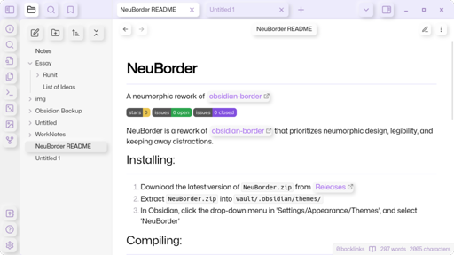

# NeuBorder 

A neumorphic rework of [obsidian-border](https://github.com/Akifyss/obsidian-border).

  

NeuBorder is a rework of [obsidian-border](https://github.com/Akifyss/obsidian-border) that prioritizes neumorphic design, legibility, and keeping away distractions.

## Installation
1. In [Obsidian](https://obsidian.md/), navigate to `Settings/Appearance/Themes/Manage`.
2. Search for "NeuBorder".
3. Select the "NeuBorder" box.
4. Select the "Install and use" box.

## Installation (Without Obsidian Theme Repository).
1. Download the latest version of `NeuBorder.zip` from [Releases](https://github.com/sq1000000/NeuBorder/releases).
2. Extract `NeuBorder.zip` into `vault/.obsidian/themes/`.
3. In Obsidian, click the drop-down menu in `Settings/Appearance/Themes`, and select "NeuBorder".

## Contribute
If you want to add a feature, you can so so with a [pull request](https://github.com/sq1000000/NeuBorder/pulls), or beg [sq1000000](https://github.com/sq1000000) to add the feature in [issues](https://github.com/sq1000000/NeuBorder/issues).

## Credits
- [Akifyss ](https://github.com/Akifyss) for the [theme](https://github.com/Akifyss/obsidian-border) that this is based off of.
- [Nichtigott](https://github.com/Nichtigott) for the [theme](https://github.com/Nichtigott/obsidian-neumorphism) that I originally took a bunch of code from.
